# PMT User Manual

<!-- START doctoc generated TOC please keep comment here to allow auto update -->
<!-- DON'T EDIT THIS SECTION, INSTEAD RE-RUN doctoc TO UPDATE -->
**Table of contents**

- [Introduction](#introduction)
- [User accounts](#user-accounts)
  - [Sign up](#sign-up)
  - [Login](#login)
  - [Multi-Login](#multi-login)
- [Menu](#menu)
  - [User](#user)
  - [View settings](#view-settings)
    - [Flatten inheritance](#flatten-inheritance)
    - [Flatten ONINAs](#flatten-oninas)
  - [Model files](#model-files)
    - [Importing a model file](#importing-a-model-file)
    - [Exporting a model file](#exporting-a-model-file)
    - [Deleting a model file](#deleting-a-model-file)
    - [Selecting a profile](#selecting-a-profile)
    - [Adding a profile](#adding-a-profile)
    - [Renaming a profile](#renaming-a-profile)
    - [Deleting a profile](#deleting-a-profile)
- [Model Browser](#model-browser)
  - [Model Tree](#model-tree)
    - [Icons](#icons)
    - [States](#states)
  - [Details pane](#details-pane)
    - [Profile pane](#profile-pane)
      - [Packages](#packages)
      - [Classes](#classes)
      - [Properties](#properties)
    - [Classes/Properties pane](#classesproperties-pane)
    - [Info pane](#info-pane)
  - [Navigation](#navigation)
  - [Search](#search)
  - [View settings](#view-settings-1)
  - [Consistency checks](#consistency-checks)

<!-- END doctoc generated TOC please keep comment here to allow auto update -->

## Introduction

## User accounts

The *PMT* has a very basic user management with the sole intention to assign imported model files to a specific user. A user can sign in without a password just by entering his user id, so the only way to protect the account is by keeping the user id a secret.   

### Sign up

When you open the *PMT* in the browser, you will see a combined *Sign up* and *Login* form. 

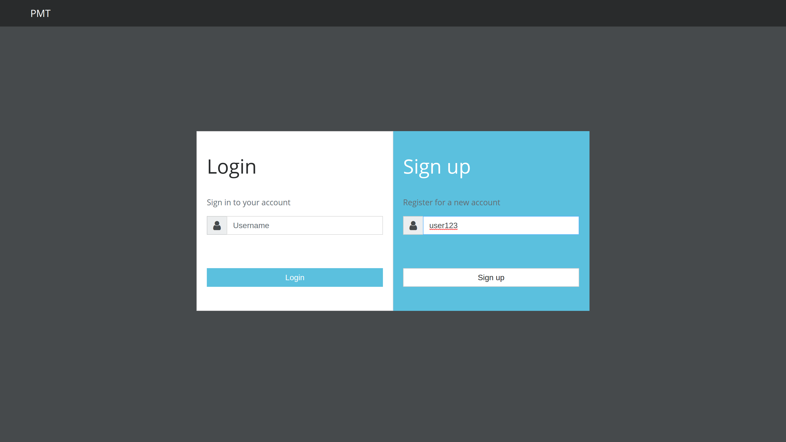

Enter your desired user id on the right and press *Enter* or click on *Register*. If the user id is already taken, an error message will occur and you have to try with a different id. If the registration succeeds, you can proceed to the *Login*.

### Login

Enter your user id on the left of the combined *Sign up* and *Login* form and press *Enter* or click on *Login*. If the user id does not exist, an error message will occur. If the login succeeds, you will be redirected either to the *Model Browser* or the *Menu* if it is your first login.

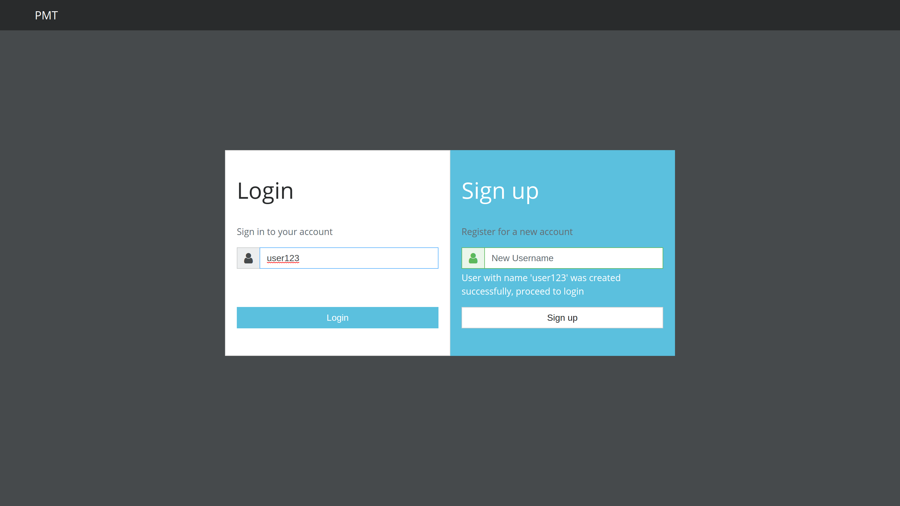

### Multi-Login

You can open the *PMT* in different browsers at the same time and login with the same user account.

You can also open the *PMT* in multiple tabs of the same browser. That will only require you to login once.

## Menu

The menu can be opened by clicking on the icon in the top left corner. It will automatically be opened on your first login. To close the menu, click on the icon again or click somewhere in the space right of the menu.

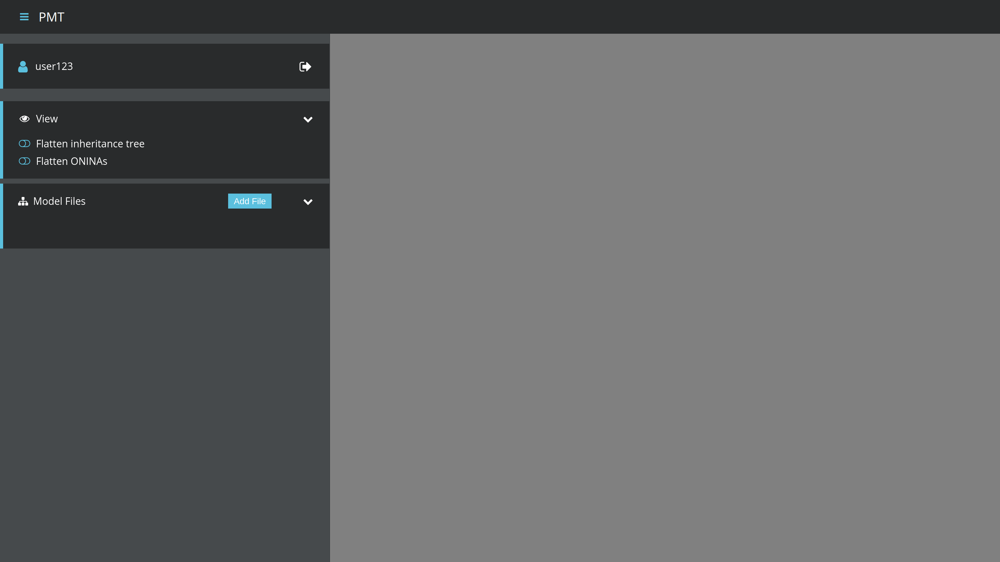

### User

At the top of the menu, you will see your user id and a logout link. The logout link will take you back to the *Login*. 

There is no need to logout, you can just close your browser. The *PMT* will return to where you left it when you open it again in the same browser.

### View settings

The *PMT* supports two special view options that simplify the model by flattening certain aspects of it. The two options can be combined.

#### Flatten inheritance

Activating this option will flatten some aspects of class inheritance. Abstract classes and information about superclasses and subclasses will be hidden. Furthermore the *Properties pane* for a class will show inherited properties in addition to its own properties. The batch editing actions of a class will include inherited properties as well. 

Whenever there is a profile editing action that behaves different with this option activated, there will be a warning icon to indicate it.

#### Flatten ONINAs

Activating this option will flatten the *ONINA* modeling construct. It will hide the special *Meta* and *Reason* classes. Whenever the type of a property is a *Meta* or *Reason* class, the type of the *Value* property of the *Reason* class will be used instead.

### Model files

This pane shows a list of already imported model files and allows to manage model files and profiles. The list is sorted by time of addition, so the model file that was imported last will appear on top. Clicking on the name of a model file will open the list of its profiles. 

#### Importing a model file

To import a model file, click on *Add file* in the menu. When the file browser opens, choose a model file (created by *ShapeChange* using the *ModelExport* target) either as uncompressed *XML* file or compressed in a *Zip* archive.

In the next step an input field with the file name will appear. You can change the name that will be used inside the *PMT*. If a model file with the same name already exists in the *PMT*, you cannot proceed before changing it. When you are done choosing the name, click on *Import*.

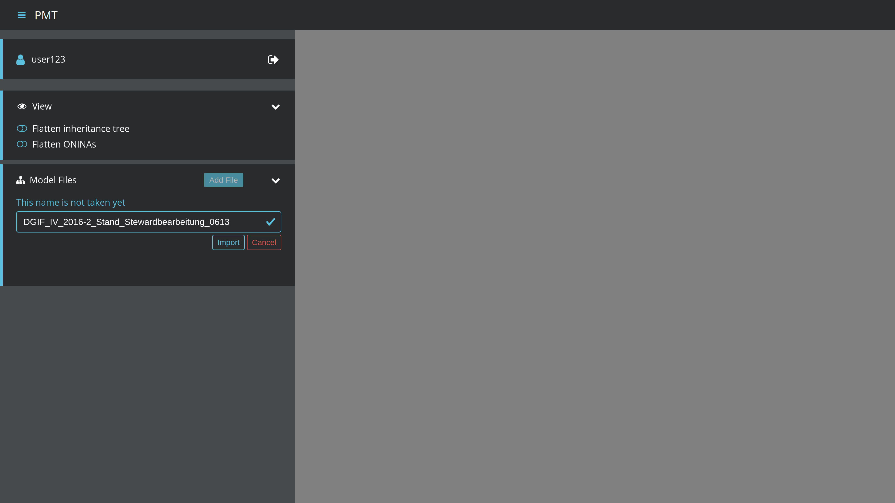

You will then see a progress bar that shows you how many percent of the import are done. The import of a model file may take several minutes. When the import is finished, the model file will appear in the list and you can dismiss the import dialog with *Ok*.

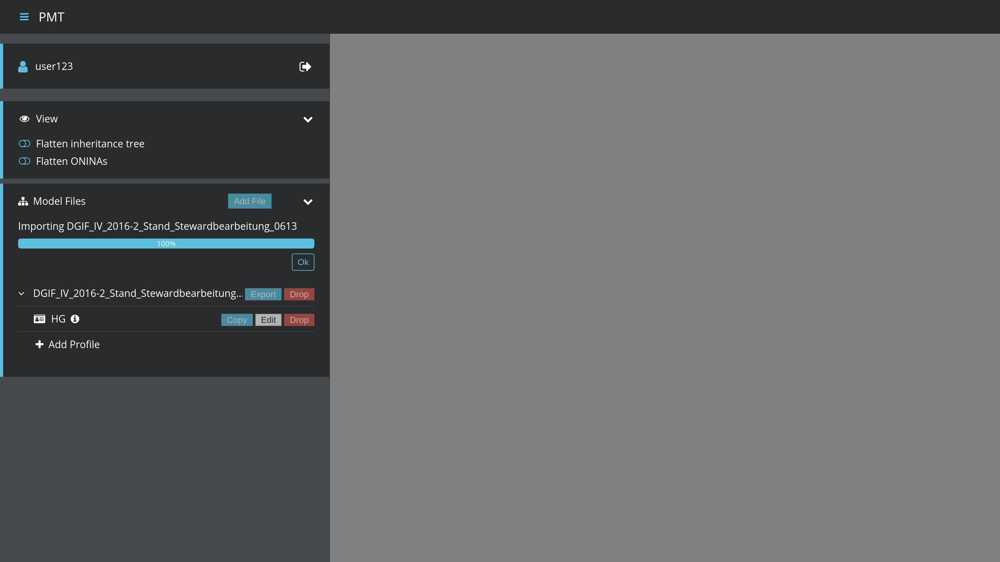

#### Exporting a model file

To export a model file, click on *Export* next to the list entry. The export will start immediately. 

You will then see a progress bar that shows you how many percent of the export are done. The export of a model file may take several minutes. When the export is finished, a *Download* button will appear below the progress bar. Click on it to save the file locally.

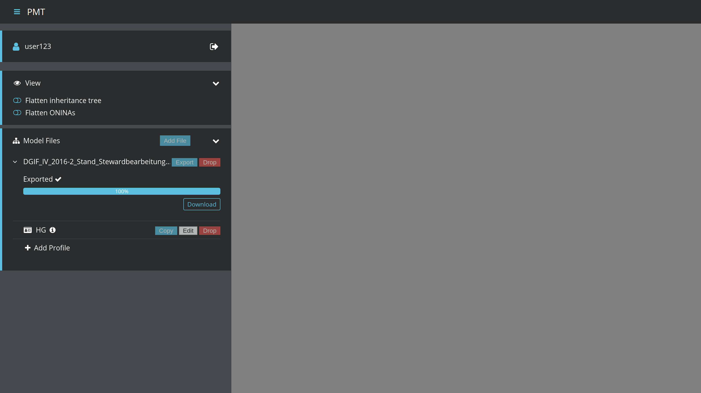

#### Deleting a model file

To delete a model file, click on *Drop* next to the list entry. A confirmation dialog will appear. If you really want to delete the model file, click on *Delete*, otherwise on *Cancel*.

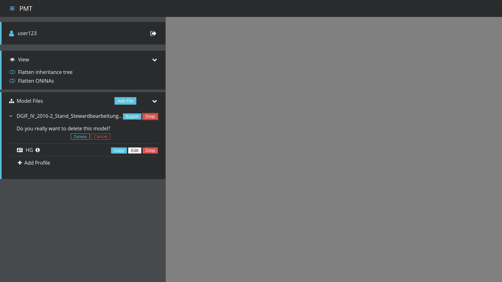

#### Selecting a profile

To open a profile in the *Model Browser*, click on the model file name if the profile list is not opened yet, and then click on the profile you want to open. This will close the menu and show the *Model Browser* with the selected profile. If you open the menu again, the selected model file and profile are highlighted.

#### Adding a profile

To add a profile to a model file, click on *Add Profile* at the bottom of the profile list. An input field will appear where you should enter the name of the new profile. Clicking on *Add* to finish the addition will only be possible if you enter a name that is unique for the model file.

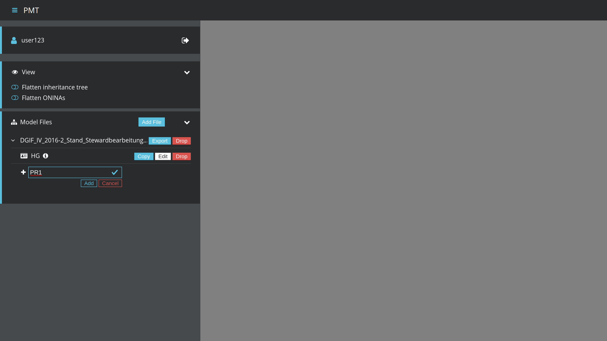

#### Copying a profile

To create a new profile by copying an existing one, click on *Copy* next to the list entry. An input field will appear where you should enter the name of the new profile. Clicking on *Add* to finish the addition will only be possible if you enter a name that is unique for the model file.

#### Renaming a profile

To rename a profile, click on *Edit* next to the list entry. An input field will appear where you should enter the new name of the profile. Clicking on *Save* to finish the renaming will only be possible if you enter a name that is unique for the model file.

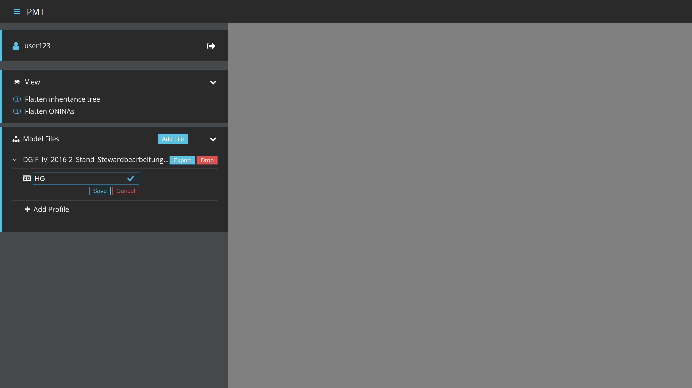

#### Deleting a profile

To delete a profile, click on *Drop* next to the list entry. A confirmation dialog will appear. If you really want to delete the profile, click on *Delete*, otherwise on *Cancel*.

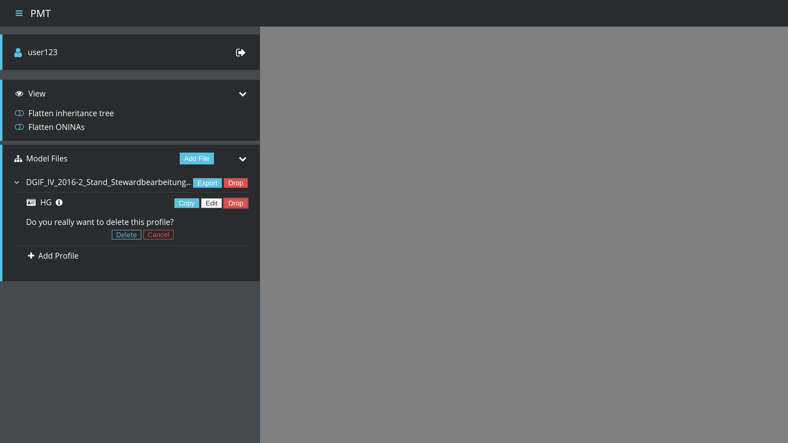

## Model Browser

### Model Tree

The model tree shows the packages, classes and properties of the selected model file in a tree structure. Clicking on an item in the tree will show or hide its children and open the item in the *Details pane*.

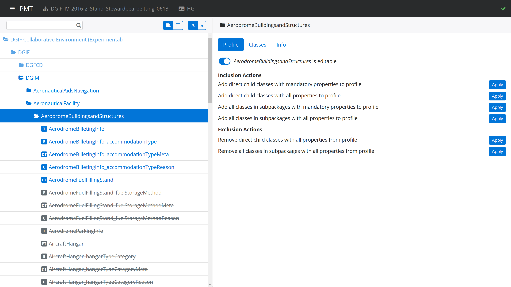

The type of each item is indicated by an icon, the coloring of an item indicates its state.   

#### Icons

- Package

  

- Class
  - Feature type

    

  - Type

    

  - Data type

    

  - Code list

    

  - Enumeration

    

  - Union

    

  - No stereo type

    

- Property
  - Attribute

    

  - Association role

    

#### States

- Included in profile

  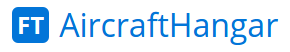

- Not included in profile

  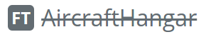

- Not editable

  

- Selected

  

### Details pane

The *Details pane* shows the details for the item that is selected in the *Model tree*. The name of the item is shown at the top of the *Details pane* including its type and state indicators. 

#### Profile pane

The *Profile pane* allows you to edit the profile information for the selected item. There are different actions available for different item types.

##### Packages

For packages, at the top you find a toggle which decides if the package is editable. If you switch the toggle, that will also switch it recursively for all sub-packages. If a package is not editable, that means you cannot edit the profile information for classes and properties contained in the package.

Below you find batch editing actions. These allow you to add to or remove from the profile either only the direct child classes of the package or all classes in all sub-packages.

##### Classes

For classes, at the top you find a toggle which decides if the class is included in the profile. If you add the class to the profile, that will automatically add its superclasses and its mandatory properties. If you remove the class from the profile, that will automatically remove its subclasses and all of its properties.

Below you find batch editing actions. These allow you to add to or remove from the profile the optional properties of the class.

For classes with stereotype *featuretype*, you find the profile parameter *geometry* setting at the bottom. This allows you to limit the valid geometry types for a *featuretype* in the profile.

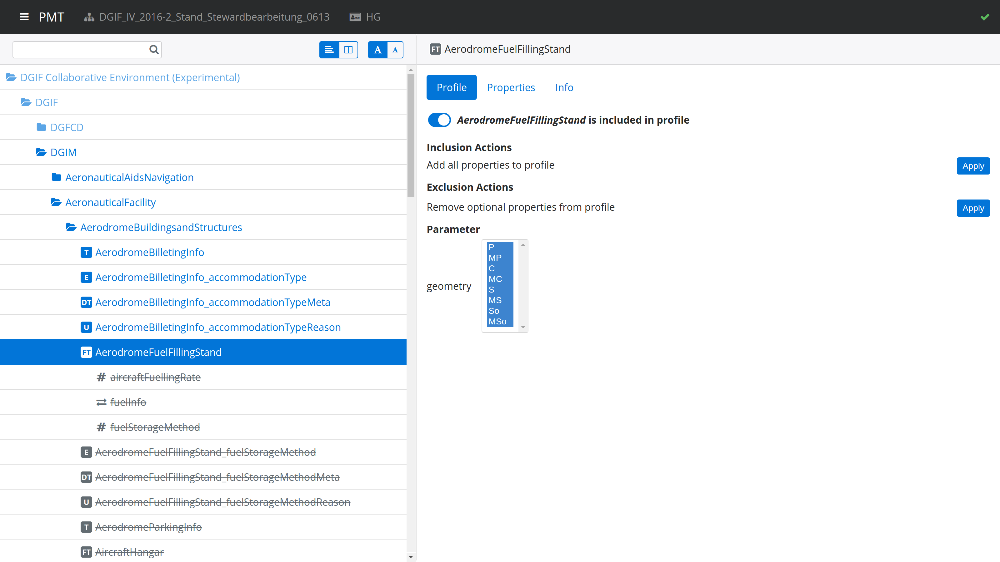

##### Properties

For properties, at the top you find a toggle which decides if the property is included in the profile. The toggle is only enabled if the containing class is already included in the profile and if the property is optional. If you add the property to the profile, that will automatically add its type class. On the other hand, if you remove a property from the profile, its type class will not automatically be removed from the profile (since other properties that belong to the profile may have the same type).

Below you find the profile parameter *cardinality* setting. This allows you to limit the cardinality of a property in the profile.

For association roles, you will also see the profile parameter *isNavigable* setting. This allows you to render a bidirectional association unidirectional.

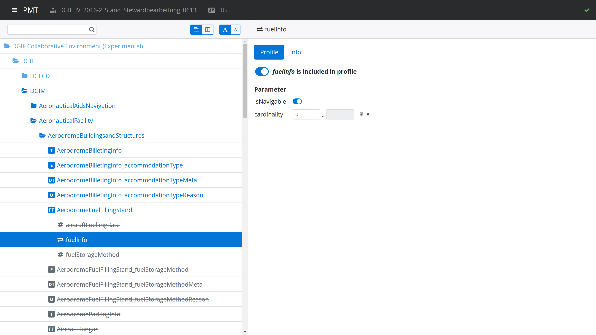

#### Classes/Properties pane

This pane shows the list of classes contained in a selected package or the list of properties contained in a selected class respectively. On the left of each list entry is a toggle that decides if the item is included in the profile. The toggle behaves in the same way as the ones in the *Profile pane*. If you click on the item name, that item will be selected in the model tree and shown in the details pane.

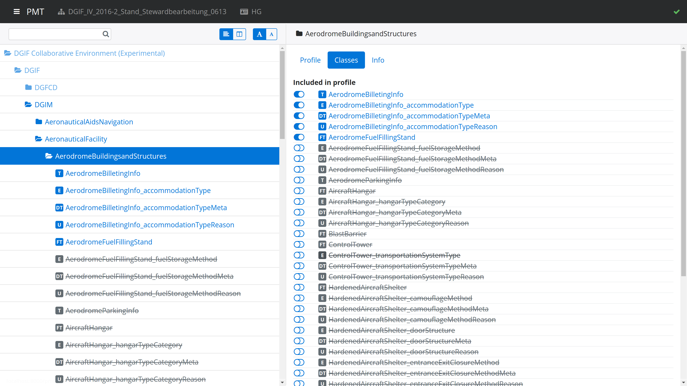

If the list shows properties of a class, on the right of each property its cardinality and its type class will be shown. Clicking on the type name, will jump to the type in the model tree and details pane.

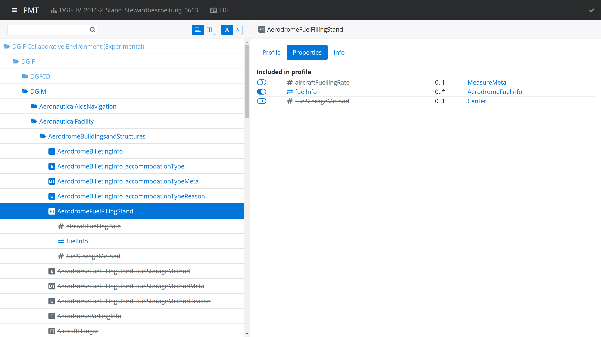

#### Info pane

This pane shows various information from the model for the selected item, like description, definition, alias, stereotypes and tagged values. For classes it will also show links to superclasses and subclasses, for properties it shows links to the type and for association roles it will show links to the association.

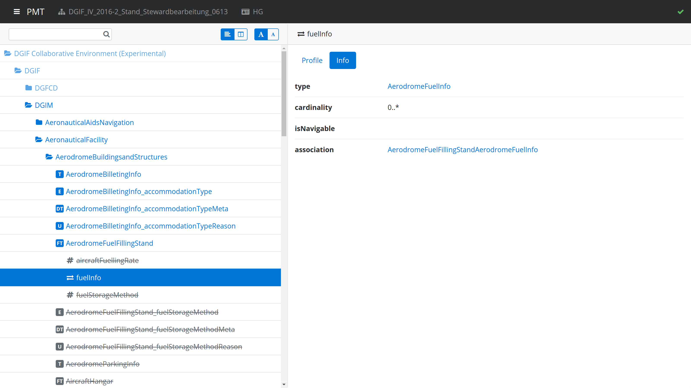

If you click on a link to an association, the info pane will show the information for the association, but the association is not shown in the model tree. The information for the association includes links to its two association roles.

### Navigation

When you select items in the model tree or follow links in the details pane, the URL in the browser address bar changes accordingly. That means you can use the browsers back and forward buttons to navigate through the history of selected items. It also means you can copy the URL and open it in a different browser to open the *PMT* with the same item selected.

### Search

Above the model tree you will find the search box. This allows you to filter the items in the model tree by matching the search value against item names, aliases, descriptions and definitions. 

The search will start automatically if you enter at least three characters and then pause typing for a second. To reset the search value, you can click on the icon at the right of the search box. The search is always case insensitive and uses partial matching. So if you type for example `int`, that will match `Integer` as well as `Point`. 

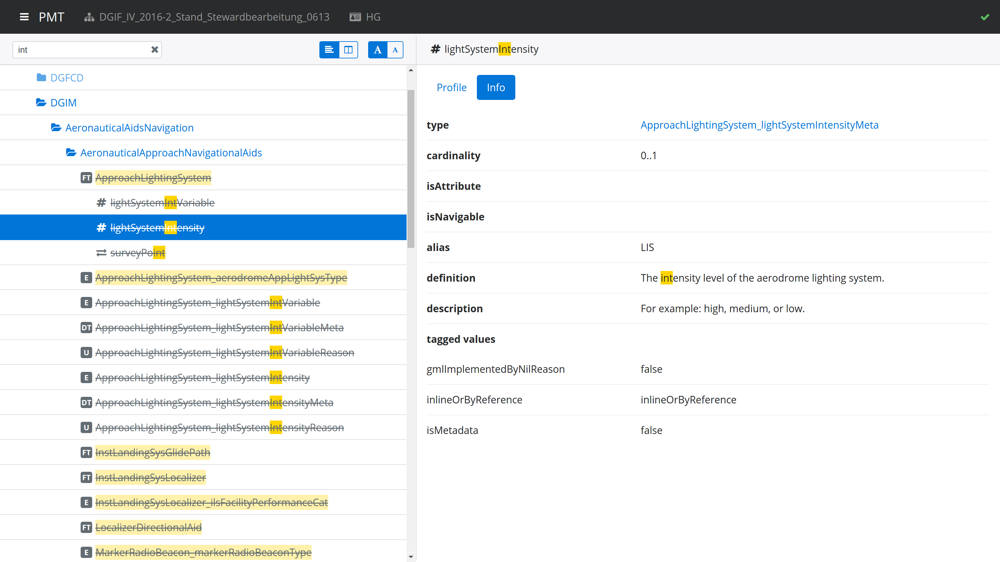

Items that are not matched by the search value and do not satisfy any of the following conditions are hidden. If a package is matched, its contained classes will not be hidden. If a class is matched, its contained properties will not be hidden. The parent elements on the path to the top of the tree of a matched element are not hidden.

If the name of an item is matched, the matching part will be highlighted in yellow in the model tree. If the alias, description or definition of an item is matched, the item will be highlighted in a light yellow in the model tree. In the info pane, the matching part of the alias, description or definition will be highlighted in yellow.

### View settings

Next to the search box are two toggles to adjust the presentation of the model tree. 

The first toggle lets you switch from the default tree view to a three pane view. In this view, packages, classes and properties are not mixed in a single tree but are presented in three separate panes. This is only a different presentation, the behavior stays the same.

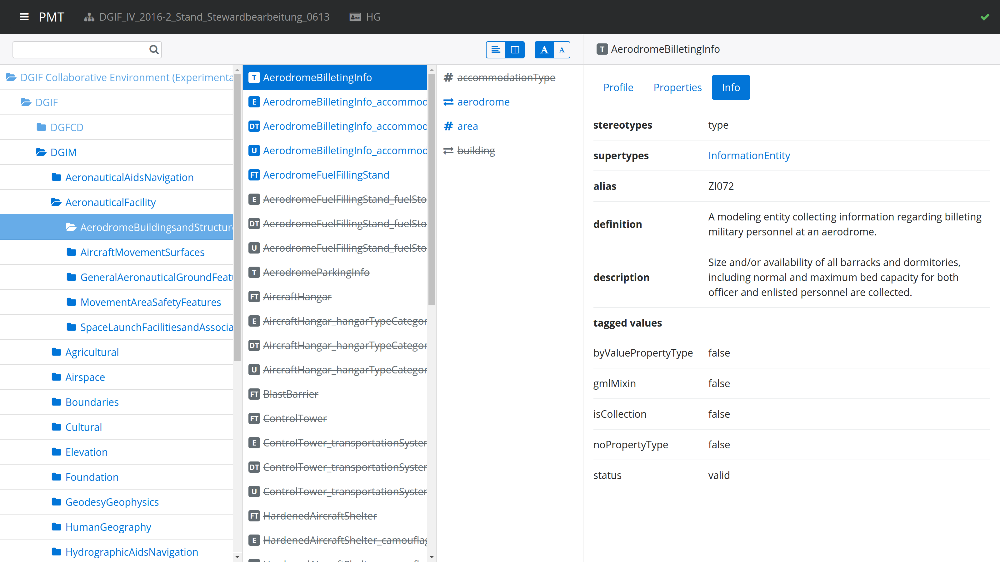

The second toggle lets you switch to a smaller font size for the model tree. That allows to see more items on screen without scrolling.

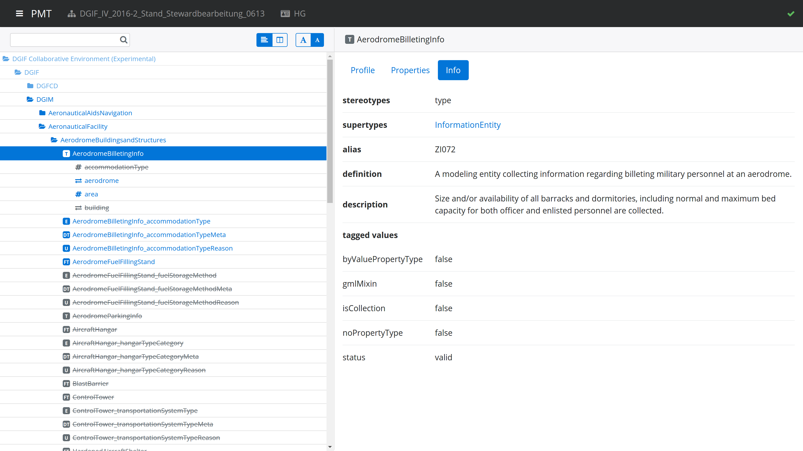

### Consistency checks

The *PMT* will automatically check the consistency of a profile for every write transaction. When you import a model file, the consistency for every profile in the model file will be checked during the import. When you change the profile information for a class or property or the editability of a package, the consistency of the selected profile will be checked.

If the selected profile has consistency errors, at the top left of the window you will find a red circle with the numbers of errors. When you click on the circle, the list of errors will pop up. When you click on an error, the model browser will jump to the erroneous item. 

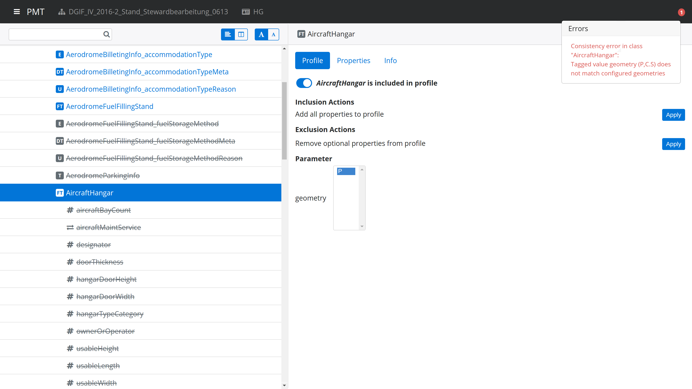

If the selected profile has no errors, you will see a green check mark instead of the red circle. During write transactions, you will see a spinner icon in the same place.

There are seven different checks for now:

- If a class is included in the profile, its superclasses have to be included as well, except when they are contained in a non-editable package.
- If a class is included in the profile, its mandatory properties have to be included as well.
- If a property is included in the profile, its containing class has to be included as well. 
- If a property is included in the profile, its type class has to be included as well, except when it is contained in a non-editable package.
- If a class with stereotype *featuretype* has a tagged value *geometry* list, it has to be a subset of the *PMT*s list. The profile parameter *geometry* list has to be a subset of the intersection of the tagged value *geometry* list and the *PMT*s list.
- The profile parameter *isNavigable* may only occur for association roles. It may not render an association unnavigable.
- The profile parameter *cardinality* may only restrict the cardinality of a property. It may not extend the cardinality range.

